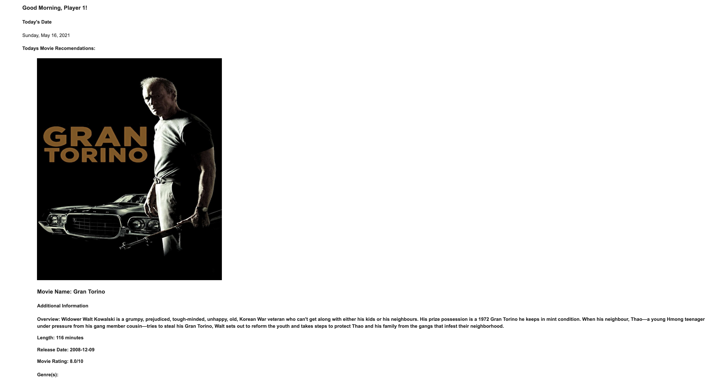

# Movie Suggestion App

This web application sends you a customized email with movie suggestions based on your preferences. Once on the home page, users can visit the 'Select' tab to insert their preferences for genre, movie rating, minimum release year, minimum audience rating (out of 10), minimum run time, and maximum run time. After entering their name and email, users will receive a custom email sent to their inbox that generates three movie suggestions.



Once up and running, the web application will be running on:

```sh
https://git.heroku.com/still-earth-03396.git
```

## Installation

Fork [this repo](https://github.com/NikoRestifo/Movie-Recommendation-Generator), then clone or download the forked repo onto your local computer (for example to the Desktop), then navigate there from the command-line:

```sh
cd ~/Desktop/Movie-Recommendation-Generator-py/
```

Use Anaconda to create and activate a new virtual environment, perhaps called "movies-env":

```sh
conda create -n movies-env python=3.8
conda activate movies-env
```

Then, within an active virtual environment, install package dependencies:

```sh
pip install -r requirements.txt
```

## Configuration

Follow these [SendGrid setup instructions](https://github.com/prof-rossetti/intro-to-python/blob/master/notes/python/packages/sendgrid.md#setup) to sign up for a SendGrid account, configure your account's email address (i.e. `SENDER_EMAIL_ADDRESS`), and obtain an API key (i.e. `SENDGRID_API_KEY`).

Next, follow these [TMDB setup instructions](https://developers.themoviedb.org/3/getting-started/introduction) to obtain a TMBD API key (i.e. `TMDB_API_KEY`).

Create a new file called ".env" in the root directory of this repo, and paste the following contents inside, using your own values as appropriate:

```sh
# these are example contents for the ".env" file:

# required vars:
TMBD_API_KEY="_______________"
SENDGRID_API_KEY="_______________"
SENDER_EMAIL_ADDRESS="_______________"
CI_ENV="True"
```


## Usage

To run the code on your command line system, use the following command:

```sh
python -m app.main

# in production mode:
APP_ENV="production" python -m app.main
```

## Web App

To run the website locally on your computer, use the following command:
```sh
#mac
FLASK_APP=web_app flask run

#windows
export FLASK_APP=web_app
flask run
```

To visit the website while runninig locally, enter the following into your browser:

```sh
http://127.0.0.1:5000/
```


## Testing

Running tests:

```sh
pytest

# in CI mode:
CI=true pytest
```
