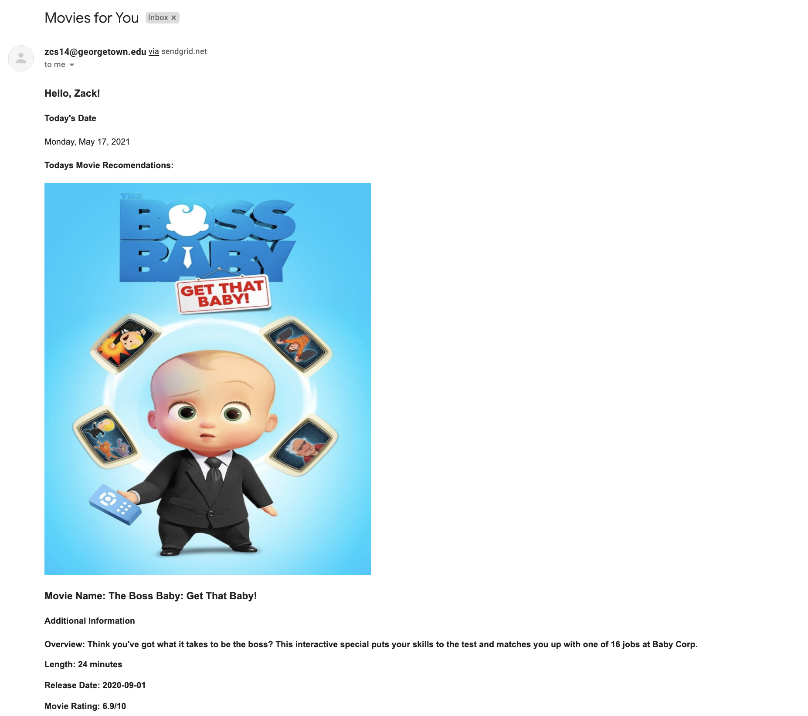

# Movie Suggestion App

Sends you a customized email with movie suggestions based on your preferences!



## Installation

Fork this repo, then clone or download the forked repo onto your local computer (for example to the Desktop), then navigate there from the command-line:

```sh
cd ~/Desktop/final_project_244-py/
```

Use Anaconda to create and activate a new virtual environment, perhaps called "movies-env":

```sh
conda create -n movies-env python=3.8
conda activate movies-env
```

Then, within an active virtual environment, install package dependencies:

```sh
pip install -r requirements.txt
```

## Configuration

Follow these [SendGrid setup instructions](https://github.com/prof-rossetti/intro-to-python/blob/master/notes/python/packages/sendgrid.md#setup) to sign up for a SendGrid account, configure your account's email address (i.e. `SENDER_EMAIL_ADDRESS`), and obtain an API key (i.e. `SENDGRID_API_KEY`).

Create a new file called ".env" in the root directory of this repo, and paste the following contents inside, using your own values as appropriate:

```sh
# these are example contents for the ".env" file:

# required vars:
SENDGRID_API_KEY="_______________"
SENDER_EMAIL_ADDRESS="_______________"
